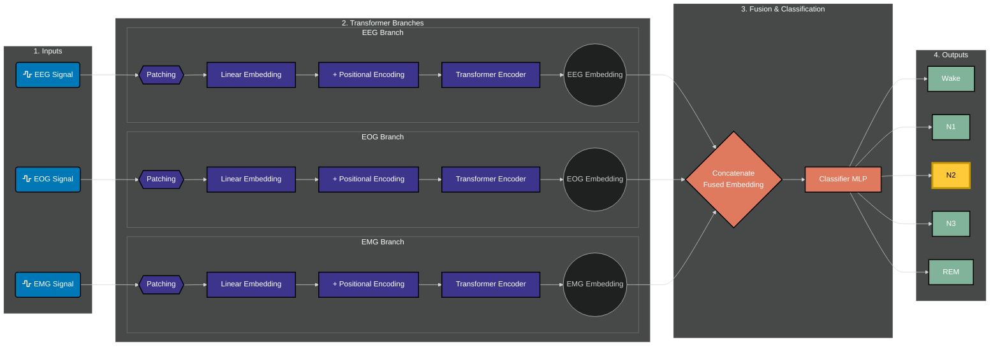

# Hệ thống Phân loại Trạng thái Giấc ngủ sử dụng Deep Learning

Dự án này là một ứng dụng web được xây dựng bằng Flask, cho phép người dùng trực quan hóa và phân loại các giai đoạn của giấc ngủ từ các file tín hiệu sinh học (EDF). Hệ thống sử dụng hai mô hình Deep Learning tiên tiến là **Sleep Transformer** và **DeepSleepNet** để dự đoán trạng thái giấc ngủ (Wake, N1, N2, N3, REM) từ ba kênh tín hiệu chính: EEG, EOG, và EMG.

## Mục lục
- [Tính năng nổi bật](#tính-năng-nổi-bật)
- [Luồng hoạt động](#luồng-hoạt-động)
- [Kiến trúc Mô hình](#kiến-trúc-mô-hình)
- [Cấu trúc Dự án](#cấu-trúc-dán)
- [Dữ liệu](#dữ-liệu)
- [Hướng dẫn Cài đặt & Chạy ứng dụng](#hướng-dẫn-cài-đặt--chạy-ứng-dụng)
- [Các công nghệ sử dụng](#các-công-nghệ-sử-dụng)

## Tính năng nổi bật

- **Phân loại Đa mô hình**: Tích hợp hai mô hình mạnh mẽ (`MultiChannelSleepTransformer` và `MultiChannelDeepSleepNet`) để phân loại và so sánh kết quả.
- **Trực quan hóa Tín hiệu**: Sử dụng Chart.js để vẽ biểu đồ tín hiệu EEG, EOG, EMG, cho phép người dùng phóng to và di chuyển trên biểu đồ để phân tích chi tiết.
- **Tương tác Linh hoạt**: 
    - Cung cấp danh sách các file EDF mẫu có sẵn để người dùng lựa chọn và phân tích nhanh.
    - Cho phép người dùng tải lên file EDF 30 giây của riêng mình để nhận dự đoán tức thì.
- **So sánh Trực quan**: Tự động so sánh kết quả dự đoán của AI với nhãn gốc (ground-truth) được trích xuất từ tên file, làm nổi bật sự khác biệt và độ chính xác.
- **Giao diện Thân thiện**: Giao diện web hiện đại, dễ sử dụng được xây dựng với Bootstrap.

## Luồng hoạt động

1.  **Chọn/Tải file**: Người dùng có thể chọn một file EDF có sẵn từ thư mục `datasets` hoặc tải lên một file mới thông qua giao diện web.
2.  **Xử lý Backend (Flask)**:
    - `app.py` nhận yêu cầu.
    - Sử dụng thư viện `mne` để đọc và trích xuất dữ liệu từ 3 kênh tín hiệu (`EEG Fpz-Cz`, `EOG horizontal`, `EMG submental`) trong file EDF.
    - Dữ liệu được tiền xử lý bằng phương pháp chuẩn hóa Z-score, tương tự như trong quá trình huấn luyện mô hình.
    - Dữ liệu đã chuẩn hóa được đưa vào hai mô hình đã được huấn luyện sẵn (`model_transformer` và `model_deepsleepnet`).
3.  **Dự đoán**: Cả hai mô hình đều đưa ra dự đoán về 5 giai đoạn giấc ngủ. Backend sẽ tính toán xác suất cho mỗi giai đoạn.
4.  **Trả kết quả về Frontend**:
    - Backend gửi lại một gói tin JSON chứa kết quả dự đoán, phân phối xác suất, nhãn gốc và dữ liệu tín hiệu của 3 kênh.
5.  **Hiển thị trên Giao diện**:
    - JavaScript phía client nhận dữ liệu và cập nhật giao diện, hiển thị kết quả so sánh và vẽ biểu đồ tín hiệu bằng Chart.js.

## Kiến trúc Mô hình

Dự án sử dụng hai kiến trúc mô hình riêng biệt để xử lý dữ liệu chuỗi thời gian từ tín hiệu sinh học. Cả hai đều được điều chỉnh để làm việc với đầu vào 3 kênh.

### 1. MultiChannelSleepTransformer (`model.py`)

- **Ý tưởng**: Sử dụng kiến trúc Transformer, vốn rất thành công trong xử lý ngôn ngữ tự nhiên, để nắm bắt các phụ thuộc dài hạn trong tín hiệu giấc ngủ.
- **Cấu trúc**:
    - Mỗi kênh (EEG, EOG, EMG) được xử lý bởi một nhánh Transformer riêng biệt.
    - Trong mỗi nhánh, tín hiệu được chia thành các "patch" (đoạn nhỏ), được nhúng và thêm mã hóa vị trí (Positional Encoding).
    - Các embedding này sau đó được đưa qua một bộ mã hóa Transformer (Transformer Encoder).
    - Đặc trưng đầu ra từ ba nhánh được kết hợp (concatenate) và đưa qua một lớp phân loại (classifier) cuối cùng.

**Sơ đồ kiến trúc trực quan:**


### 2. MultiChannelDeepSleepNet (`model.py`)

- **Ý tưởng**: Dựa trên kiến trúc DeepSleepNet nổi tiếng, kết hợp cả mạng tích chập (CNN) để trích xuất đặc trưng cục bộ và mạng hồi quy (LSTM) để học các mối quan hệ tuần tự.
- **Cấu trúc**:
    - Tương tự như Transformer, mỗi kênh được xử lý bởi một nhánh DeepSleepNet riêng.
    - Mỗi nhánh bao gồm hai luồng CNN với kích thước kernel khác nhau để học đặc trưng ở các tần số khác nhau (Low-Freq và High-Freq).
    - Đầu ra của các lớp CNN được cộng lại và đưa vào một mạng LSTM hai chiều (Bidirectional LSTM).
    - Đặc trưng cuối cùng từ ba nhánh được kết hợp và phân loại.

**Sơ đồ kiến trúc trực quan:**```mermaid
%%{
  init: {
    'fontFamily': 'Fira Code, monospace',
    'theme': 'dark',
    'flowchart': {
      'htmlLabels': true,
      'curve': 'basis'
    }
  }
}%%

graph LR
    %% Định nghĩa các Style cho đẹp (giống như trên) %%
    classDef inputStyle fill:#0077b6,color:#fff,stroke:#000,stroke-width:2px
    classDef branchStyle fill:#3d348b,color:#fff,stroke:#000,stroke-width:2px
    classDef fusionStyle fill:#e07a5f,color:#fff,stroke:#000,stroke-width:2px
    classDef outputStyle fill:#81b29a,color:#fff,stroke:#000,stroke-width:2px

    %% --- Cụm Input --- %%
    subgraph 1. Inputs
        direction TB
        EEG("<i class='fa fa-wave-square'></i> EEG Signal")
        EOG("<i class='fa fa-wave-square'></i> EOG Signal")
        EMG("<i class='fa fa-wave-square'></i> EMG Signal")
    end
    class EEG,EOG,EMG inputStyle

    %% --- Cụm các nhánh DeepSleepNet --- %%
    subgraph 2. DeepSleepNet Branches
        direction TB
        subgraph EEG Branch
            EEG --> CNN_L1[Low-Freq CNN] --> ADD1{+}
            EEG --> CNN_H1[High-Freq CNN] --> ADD1
            ADD1 --> LSTM1[Bidirectional LSTM] --> O1((EEG Embedding))
        end
        subgraph EOG Branch
            EOG --> CNN_L2[Low-Freq CNN] --> ADD2{+}
            EOG --> CNN_H2[High-Freq CNN] --> ADD2
            ADD2 --> LSTM2[Bidirectional LSTM] --> O2((EOG Embedding))
        end
        subgraph EMG Branch
            EMG --> CNN_L3[Low-Freq CNN] --> ADD3{+}
            EMG --> CNN_H3[High-Freq CNN] --> ADD3
            ADD3 --> LSTM3[Bidirectional LSTM] --> O3((EMG Embedding))
        end
    end
    class CNN_L1,CNN_H1,CNN_L2,CNN_H2,CNN_L3,CNN_H3,ADD1,ADD2,ADD3,LSTM1,LSTM2,LSTM3 branchStyle

    %% --- Cụm Fusion & Classifier --- %%
    subgraph 3. Fusion & Classification
        direction LR
        F{Concatenate <br> Fused Embedding}
        C[Classifier MLP]
        
        O1 --> F
        O2 --> F
        O3 --> F
        F --> C
    end
    class F,C fusionStyle

    %% --- Cụm Output --- %%
    subgraph 4. Outputs
        direction TB
        W[Wake]
        N1[N1]
        N2[N2]
        N3[N3]
        REM[REM]
    end
    class W,N1,N2,N3,REM outputStyle

    %% --- Nối các cụm lớn --- %%
    C --> W & N1 & N2 & N3 & REM
    
    %% --- Làm nổi bật kết quả dự đoán --- %%
    style N2 fill:#ffca3a,stroke:#c99a00,stroke-width:4px,color:#000
```

## Cấu trúc Dự án
```
.
├── app.py                      # File chính của ứng dụng Flask
├── generate_demo.py            # Script để tạo dữ liệu EDF giả lập cho demo
├── model.py                    # Định nghĩa kiến trúc các mô hình PyTorch
├── requirements.txt            # Danh sách các thư viện Python cần thiết
├── datasets/                   # Thư mục chứa các file EDF mẫu
│   └── ...
├── model_weights/              # Thư mục chứa các trọng số đã huấn luyện
│   ├── MultiChannelDeepSleepNet_best.pt
│   └── MultiChannelSleepTransformer_best.pt
├── static/
│   └── css/
│       └── style.css           # File CSS tùy chỉnh
└── templates/
    └── index.html              # Template giao diện chính
```

## Dữ liệu

- **Định dạng**: Hệ thống yêu cầu đầu vào là các file **EDF (European Data Format)**.
- **Cấu trúc mỗi file**: Mỗi file EDF phải là một *epoch* (đoạn) dài 30 giây, chứa ít nhất 3 kênh tín hiệu sau:
    - `EEG Fpz-Cz`
    - `EOG horizontal`
    - `EMG submental`
- **Tần số lấy mẫu**: Các mô hình được huấn luyện với dữ liệu có tần số lấy mẫu là **100 Hz**.
- **Tạo dữ liệu mẫu**: Bạn có thể chạy script `generate_demo.py` để tự tạo ra một bộ dữ liệu demo.
  ```bash
  python generate_demo.py
  ```

## Hướng dẫn Cài đặt & Chạy ứng dụng

**Yêu cầu**: Python 3.8+ và pip.

**Bước 1: Clone repository**
```bash
git clone https://github.com/nam-htran/ECG_Analysis_Detection
cd ECG_Analysis_Detection
```

**Bước 2: Tạo môi trường ảo (khuyến khích)**
```bash
python -m venv venv
source venv/bin/activate   # Trên Windows: venv\Scripts\activate
```

**Bước 3: Cài đặt các thư viện cần thiết**
```bash
pip install -r requirements.txt
```

**Bước 4: Chuẩn bị dữ liệu và trọng số**
- Đảm bảo bạn có thư mục `datasets` chứa các file EDF mẫu.
- Đảm bảo bạn có thư mục `model_weights` chứa các file trọng số `.pt` đã được huấn luyện.

**Bước 5: Chạy ứng dụng Flask**
```bash
python app.py
```

**Bước 6: Truy cập ứng dụng**
Mở trình duyệt web và truy cập vào địa chỉ: `http://127.0.0.1:5000`

## Các công nghệ sử dụng

- **Backend**: Flask, PyTorch, MNE-Python, NumPy
- **Frontend**: HTML5, CSS3, Bootstrap 5, JavaScript, Chart.js
- **Trực quan hóa Kiến trúc**: Mermaid.js
